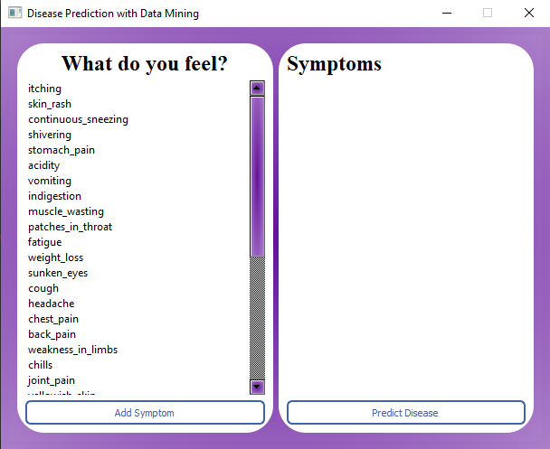
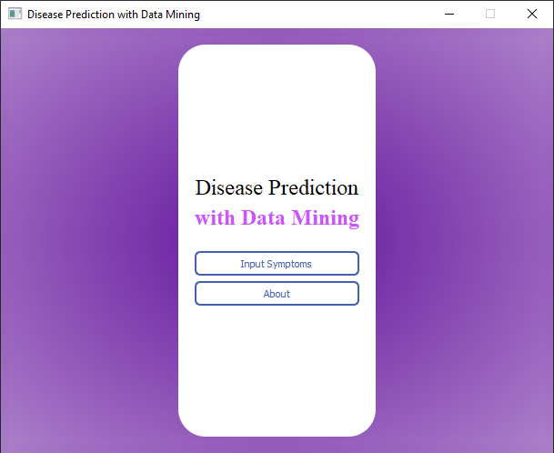
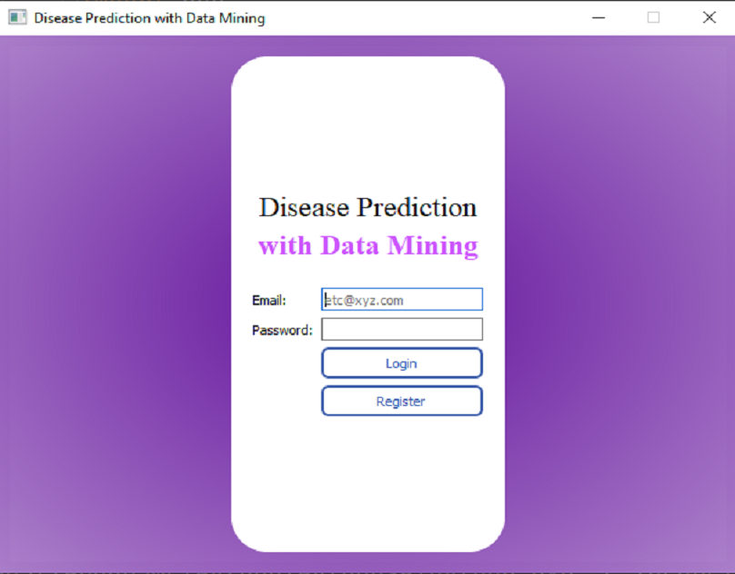
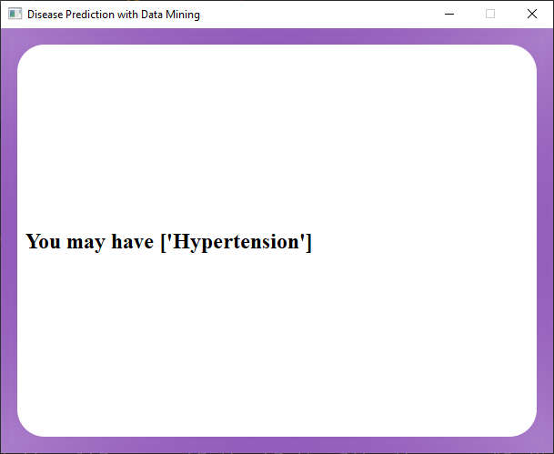

# Disease Prediction using Data Mining






## Libraries requirements
* PyQt5~=5.15.2
* numpy~=1.15.4
* pandas~=1.1.5

## Setting up environment
  * Install Libraries using requirements.txt
   ```bash
   pip3 install -r requirements.txt
   ```
  * Run the main.py file by using 
   ```bash
   python main.py
   ```

## Description
It might have happened so many times that 
you or someone yours need doctors help immediately,
but they are not available due to some reason.
The Health Prediction system is an end user support 
and online consultation project. Here we propose a system
that allows users to get instant guidance on their
health issues through an intelligent health care 
system online. The system is fed with various symptoms
and the disease/illness associated with those systems.
The system allows user to share their symptoms and issues.
It then processes users symptoms to check for various illness
that could be associated with it. Here we use some intelligent
data mining techniques to guess the most accurate illness that
could be associated with patient’s symptoms. If the system is 
not able to provide suitable results, it informs the user about
the type of disease or disorder it feels user’s symptoms are 
associated with. If users symptoms do not exactly match any 
disease in our database, is shows the diseases user could 
probably have judging by his/her symptoms. It also consists
of doctor address, contacts along with Feedback and 
administrator dashboard for system operations.
